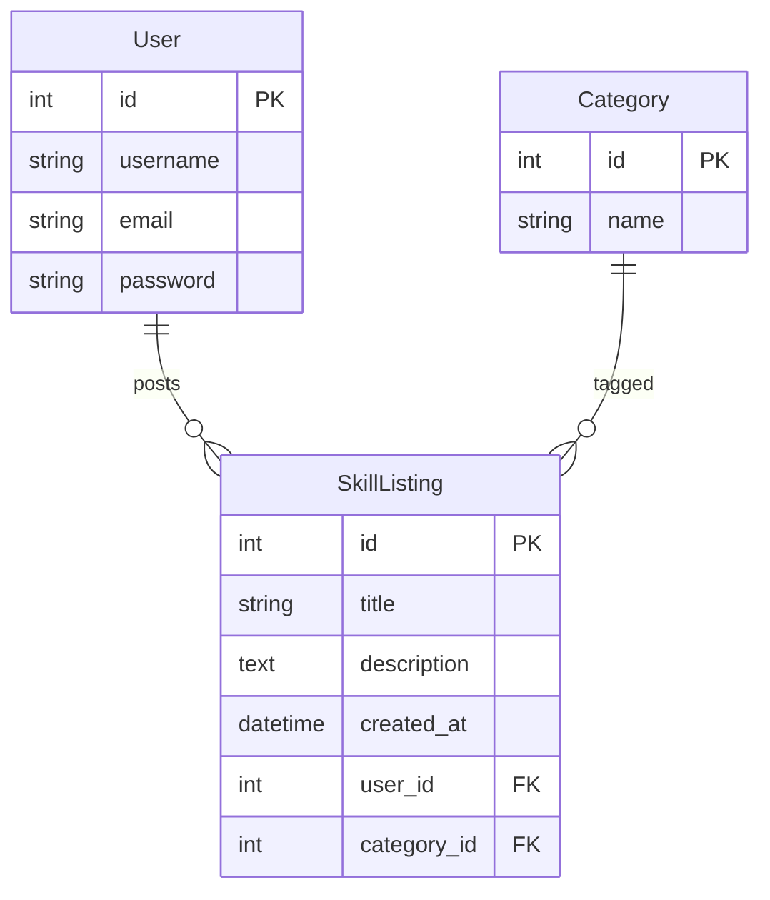

# SkillSwap Hub


SkillSwap Hub is a Django app where signed-in users publish **skill listings** (title, category, long description). Anyone can browse listings and open a detail page to see the full text and the teacher’s username and email link. Only the person who created a listing can edit or delete it—session auth and view mixins enforce that.

I built it as a bootcamp-style MVP: full CRUD on one main model related to `User`, Postgres, class-based views, and templates (no separate front-end framework).

## Data model (ERD)



## Getting started

**Source code:** [github.com/GabrielaZahoranska/SkillSwapHub](https://github.com/GabrielaZahoranska/SkillSwapHub)

Clone the repo:

```bash
git clone https://github.com/GabrielaZahoranska/SkillSwapHub.git
cd SkillSwapHub
```

**Live app:** [add your deployed URL here](https://example.com)

**Planning (Trello / wireframes / user stories):** [add your planning board link here](https://example.com)

### Local setup

1. Install [PostgreSQL](https://www.postgresql.org/) and create a database (default name matches settings: `skillswaphub`).

   ```bash
   createdb skillswaphub
   ```

2. Install dependencies and migrate:

   ```bash
   pipenv install
   pipenv run python manage.py migrate
   pipenv run python manage.py createsuperuser
   pipenv run python manage.py runserver
   ```

3. Open `http://127.0.0.1:8000/`. Sign up, add a listing under “Add listing,” and confirm it appears on “All skills.”

### Deployment env vars (typical)

Set on your host as needed:

| Variable | Purpose |
| -------- | ------- |
| `SECRET_KEY` | Django secret |
| `DEBUG` | `False` in production |
| `ALLOWED_HOSTS` | Comma-separated domains |
| `DATABASE_NAME`, `DATABASE_USER`, `DATABASE_PASSWORD`, `DATABASE_HOST`, `DATABASE_PORT` | Postgres connection |

Then run `pipenv run python manage.py collectstatic` (if you serve static files via your platform’s flow).

Replace `docs/screenshot.png` with your own screenshot from the deployed app before you turn the project in.

## Attributions

No third-party JavaScript libraries or paid assets are bundled in this MVP. Django and the Postgres driver are listed under **Technologies**.

## Technologies used

- Python 3.11  
- Django  
- PostgreSQL  
- psycopg2-binary (via Pipenv)  
- Django session authentication (login / logout / signup)  
- HTML templates + plain CSS (Flexbox + CSS Grid)

## Next steps

- Let teachers add a public “contact note” or Discord handle.
- Search and filter skills by category keyword.
- Email verification for new accounts so every listing has a reachable address.
- Optional photo per listing (with required `alt` text and no text overlaid on photos).
